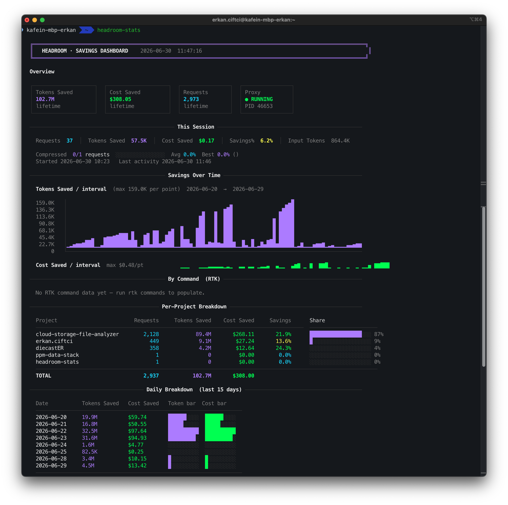

# headroom-stats

> A fancy, visual CLI dashboard for [Headroom](https://github.com/headroomlabs-ai/headroom) — a much richer alternative to the built-in `headroom perf` command.

<!-- Replace the line below with an actual screenshot after running the tool -->


---

## What is this?

`headroom-stats` is a terminal dashboard that visualises everything Headroom tracks about your token savings in one colourful, information-dense view.  
It replaces `headroom perf` with a far more visual and detailed overview:

| Feature | `headroom perf` | `headroom-stats` |
|---|---|---|
| Lifetime savings summary | ✓ | ✓ |
| Per-project breakdown | — | ✓ |
| **By Command table** (RTK) | — | ✓ |
| **Daily breakdown** (15 days) | — | ✓ |
| **Weekly summary** | — | ✓ |
| **Monthly summary** | — | ✓ |
| Savings-over-time bar chart | — | ✓ |
| Session vs lifetime view | — | ✓ |
| Active config flags | — | ✓ |
| Auto-refresh watch mode | — | ✓ |

---

## Requirements

- Python 3.10+
- [Headroom proxy](https://github.com/headroomlabs-ai/headroom) running locally (`headroom-proxy start`)
- Optional: [RTK](https://www.rtk-ai.app/) installed for the **By Command** section

---

## Installation

```bash
# Copy to somewhere on your PATH
cp headroom-stats ~/.local/bin/headroom-stats
chmod +x ~/.local/bin/headroom-stats
```

---

## Usage

```bash
# One-shot render (default: last 15 days)
headroom-stats

# Show more/fewer days in Daily Breakdown
headroom-stats --days=30

# Live auto-refresh every 5 seconds
headroom-stats --watch

# Custom refresh interval
headroom-stats --watch=10
```

---

## Sections

### Overview
Four summary cards: tokens saved, cost saved, total requests, and proxy status.

### This Session
Current session metrics including compression ratio, average savings %, and session start time.

### Savings Over Time
Bar chart of token savings per interval, trimmed to start from the first actual activity date — no dead whitespace for periods before you started using Headroom.

### By Command (RTK)
Table ranked by total tokens saved, showing count, saved tokens, average savings %, average exec time, and an impact bar.  Requires RTK to be installed.

### Per-Project Breakdown
Token and cost savings broken down by project, with a share bar.

### Daily Breakdown
Last 15 days of daily savings with dual sparkline bars. Configurable with `--days=N`.

### Weekly Breakdown
All available data aggregated by ISO week.

### Monthly Breakdown
All available data aggregated by calendar month.

### Active Config
Key Headroom configuration flags including Auto Memory, Force Kompress, Accuracy Guard, and compression settings — with real ON/OFF state detection.

---

## Related

- [Headroom](https://github.com/headroomlabs-ai/headroom) — the AI context compression proxy this tool reads from
- [RTK](https://www.rtk-ai.app/) — CLI token filtering tool whose command-level data powers the By Command section
